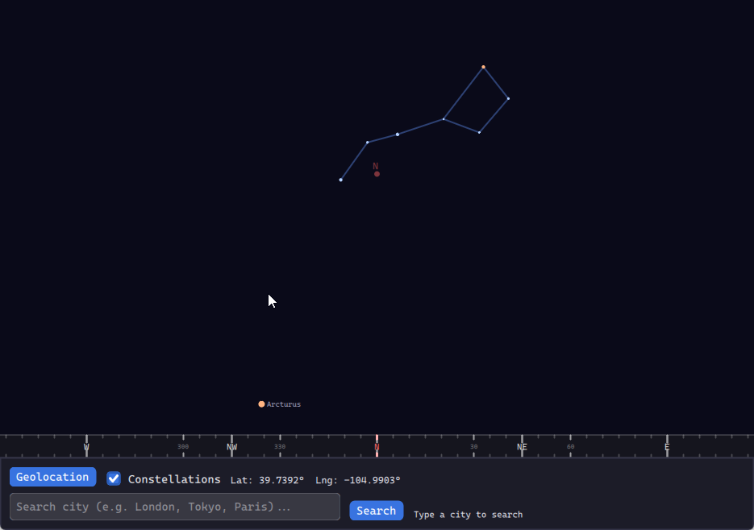

# Instant-Astronomer

[](https://larsbrubaker.github.io/instant-astronomer/)

> **▶︎ [Open it in your browser](https://larsbrubaker.github.io/instant-astronomer/)**

Point your phone at the sky and see what you're looking at. A lightweight,
serverless, client-side Rust application that renders an interactive overlay
of stars, planets, the Sun, the Moon, and constellations — driven by the
user's location, the current time, and (on mobile) the device's compass +
IMU.

The reason this exists: it's sunset, you're staring at two bright "stars"
above the horizon, and you want to know that you're looking at Venus and
Jupiter. Open the app, point your phone, you have your answer.

Built with [agg-gui](https://github.com/larsbrubaker/agg-gui) for every
pixel on screen — no separate WebGL / wgpu 3-D pipeline. Runs natively
(winit + wgpu present surface) and in the browser (WebAssembly + WebGL2
present surface) from the same workspace.

> Part of the [rust-apps](https://github.com/larsbrubaker/rust-apps) suite.

## Quick start

```powershell
# Native (hot-reload via cargo-watch)
cargo install cargo-watch        # one-time
cargo dev                        # builds + runs the native shell on save

# Or a single run
cargo run -p instant-astronomer-native

# WebAssembly
wasm-pack build instant-astronomer-wasm --target web --out-dir ../demo/public/pkg --no-typescript
```

## Workspace layout

```
instant-astronomer-core/    # astronomy math, city DB, sky + horizon widgets (wasm32-clean)
instant-astronomer-native/  # winit + wgpu present + native geolocation hook
instant-astronomer-wasm/    # cdylib wasm-bindgen shell + navigator.geolocation + deviceorientation
```

`instant-astronomer-core` is `wasm32`-clean: no `tokio`, no `winit`, no
direct `wgpu`. Platform shells inject capabilities via the
[`AstronomerPlatform`](instant-astronomer-core/src/lib.rs) trait.

## Architecture invariants

- **All UI through agg-gui.** Every visible pixel goes through agg-gui's
  `DrawCtx`. No HTML/CSS controls in the WASM shell beyond the bootstrap
  canvas; no separate wgpu 3D pipeline in core. Sky-sphere stars, planets,
  constellation lines, and the horizon HUD are 2-D primitives painted at
  positions computed by the projection pipeline in Rust.
- **Single application, two host adapters.** `instant-astronomer-core`
  exposes `build_astronomer_app` and the runtime state cells (lat / lng /
  yaw / pitch / roll / timestamp). Native and WASM shells just create a
  window/canvas, forward events, and pump the projection clock.
- **agg-gui is a path dep — improve it as you go.** The workspace
  `Cargo.toml` redirects `agg-gui = "0.2"` to `../agg-gui/agg-gui` via
  `[patch.crates-io]`. CI clones `larsbrubaker/agg-gui` as a sibling so the
  patch resolves there too. When the app needs a primitive that doesn't
  exist, add it to agg-gui first.
- **File-size guardrail.** `instant-astronomer-core/tests/file_line_count.rs`
  enforces 800 lines per file across first-party source. Split when it
  trips — don't strip comments.

See [CLAUDE.md](CLAUDE.md) for the full agent guide.

## Implementation roadmap

See [`implementation.md`](implementation.md) for the original design spec —
the three-phase delivery plan, the Yale Bright Star Catalog / Keplerian /
Meeus pipelines, and the SQLite-backed city search the asset payload is
moving toward.

## Prior art and inspiration

- **[Sky Map (stardroid)](https://github.com/sky-map-team/stardroid)** by
  the Sky Map team — the mature, Google-incubated Android star-map app
  that set the bar for "point your phone at the sky" interaction. Its
  sensor-fusion design (in particular the
  [`ExponentiallyWeightedSmoother`](https://github.com/sky-map-team/stardroid/blob/master/app/src/main/java/com/google/android/stardroid/util/smoothers/ExponentiallyWeightedSmoother.java)
  with non-linear magnitude-dependent gain on the magnetometer channel,
  and the rotation-matrix-from-vectors path in
  [`AstronomerModelImpl`](https://github.com/sky-map-team/stardroid/blob/master/app/src/main/java/com/google/android/stardroid/control/AstronomerModelImpl.kt))
  directly informs the quaternion smoothing in
  [`apply_device_orientation`](instant-astronomer-core/src/lib.rs) — yaw
  rotations get magnitude-gain crushing to kill compass jitter, while
  tilt rotations pass through unfiltered for responsive tracking.

## Support the Project

<a href="https://buymeacoffee.com/larsbrubaker"></a>

Instant-Astronomer is open-source and free to use, maintained in spare time as a labor of love. Friends James Smith and Dan Ruskin help out from time to time too.

If you find it useful, here are a few ways to help keep development going:

- **Donations:** [Buy Me a Coffee](https://buymeacoffee.com/larsbrubaker) — every coffee helps.
- **Star the repo:** Costs nothing and helps others find the project.
- **Report issues:** [Open an issue](https://github.com/larsbrubaker/instant-astronomer/issues) for bugs or feature ideas.
- **Contribute:** PRs welcome — open an issue first to discuss larger changes.

## License

MIT — see [LICENSE](LICENSE).
